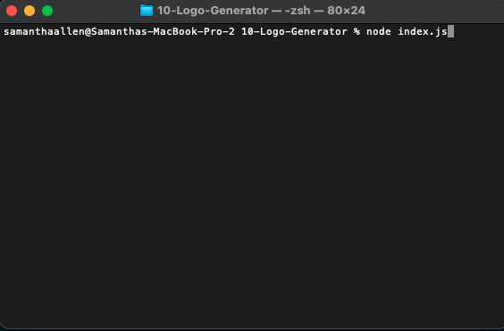
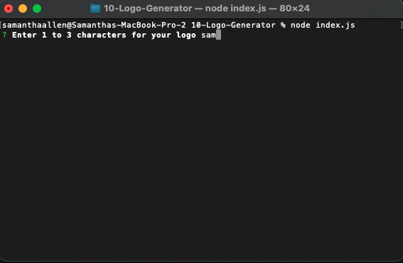
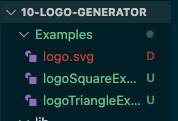

# 10-Logo-Generator

Walkthrough video link👇🏼 
https://drive.google.com/file/d/1-Rwmp5lYBxv7xe2mqTj4Lsi8_DgRB3Hj/view

## Description

My motivation to complete this project was the make sure I understood OOP. This project helped solidify my understanding more and as I get more practice the more confident I will feel on this topic. I know this is something I will be using for the rest of my career.

## Table of Contents 

- [Installation](#installation)
- [Usage](#usage)
- [Credits](#credits)
- [License](#license)

## Installation

npm install inquirer@8.2.4
npm install jest
npm install validator

## Usage

First you will need to install the required npm packages (inquirer, jest and validator). After you have everything installed in your terminal type 'node index.js' to start the application. 
 
 
 
Next the first prompt will appear to input up to 3 characters for your logo 
 
 
 
If zero or more than 3 characters are inputted an error appears 
 
 
 
 
 
Once you have chosen 1 - 3 characters. The next prompt will ask what you would like your text color to be 
 
 
 
If you enter in characters other than letters you will get an error 
 
 
 
After you enter a color keyword for your text color, next it will prompt you what shape you would like 
 
 
 
After you choose your shape, it will prompt you for the shape color you would like 
 
 
 
If you enter in characters other than letters you will get an error 
 
 
 
Once all the prompts are done, it will either display an error or that the SVG was created 
 
 
 
In the example folder the svg is created 
 
 
 
When you open the svg in VS code, it will show you the syntax with the information inputted and a preview of the SVG can be seen 
 
 
 
When viewed in the browser, you can see the SVG you created and after inspecting it. You will see the size of the svg is 300x200 
 
 
 
Here are examples of what the square and triangle SVG looks like 
 
 
 
 
 

## Credits

Thank you to my tutor Andrew who always explains things in the simplest way when im struggling to understand. Thank you to my colleague Shawn who suggested using the npm package validator for validating user input and for also helping debug my code for it when it wasnt working. 

https://www.w3.org/wiki/CSS3/Color/Basic_color_keywords
https://developer.mozilla.org/en-US/docs/Web/SVG/Tutorial/Texts
https://developer.mozilla.org/en-US/docs/Web/SVG/Attribute/font-size
https://developer.mozilla.org/en-US/docs/Web/CSS/Scaling_of_SVG_backgrounds

## License

The MIT License is short and to the point. It lets people do almost anything they want with your project, like making and distributing closed source versions.

## Badges

N/A

## Features

N/A

## How to Contribute

N/A

## Tests

After installing the required packages, navigate to the appropriate folder. Type 'node index.js' in terminal, answer prompts and voila! See the SVG you created in the examples folder.